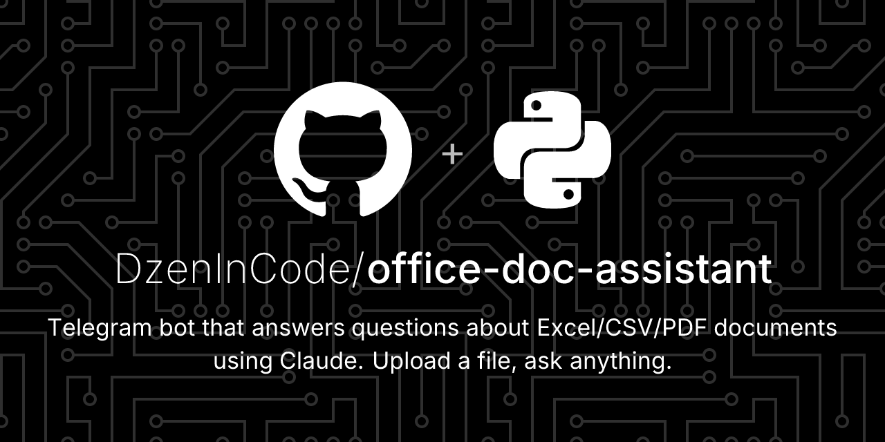

# Office Doc Assistant



A Telegram bot that answers questions about Excel, CSV, and PDF documents using Claude (Anthropic).

Upload a file → ask anything → get a grounded answer based on the document content.

> **Use case.** Sales sheets, financial reports, contracts, scraped data exports — anything you'd otherwise scroll through manually. Ideal for ops/finance teams who need quick lookups without standing up a full BI stack.

## Features

- **Multi-format input** — `.xlsx`, `.xls`, `.csv`, `.pdf`
- **Grounded answers** — Claude is instructed to answer strictly from document content (or say so when info is missing)
- **Prompt caching** — repeated questions about the same document within ~5 minutes are billed at ~10% of the first call's price
- **Per-chat memory** — each Telegram chat keeps its current document; `/clear` to forget
- **Containerized** — single `docker run` deploy

## Architecture

```
user ──Telegram──▶ bot.py ──▶ parser.py ──▶ plain text
                       │                        │
                       └──▶ llm.py ──▶ Claude API (cached)
                                          │
                       ◀── answer ────────┘
```

| File | Responsibility |
|---|---|
| `src/bot.py` | Telegram update loop, document/text handlers, in-memory chat store |
| `src/parser.py` | Decode `.xlsx` / `.csv` / `.pdf` bytes into plain text |
| `src/llm.py` | Claude wrapper with prompt caching of system + document |

## Stack

| Layer | Library |
|---|---|
| LLM | [`anthropic`](https://pypi.org/project/anthropic/) (Claude Opus 4.7 by default) |
| Telegram | [`python-telegram-bot`](https://pypi.org/project/python-telegram-bot/) |
| XLSX | `openpyxl` |
| CSV | `pandas` |
| PDF | `pypdf` |

## Quickstart

### 1. Get credentials

- **Telegram bot token** — message [@BotFather](https://t.me/BotFather), `/newbot`, save the token
- **Anthropic API key** — [console.anthropic.com](https://console.anthropic.com)

### 2. Run with Docker

```bash
git clone https://github.com/DzenInCode/office-doc-assistant
cd office-doc-assistant
cp .env.example .env
# edit .env — fill TELEGRAM_BOT_TOKEN and ANTHROPIC_API_KEY

docker build -t office-doc-assistant .
docker run --env-file .env office-doc-assistant
```

### 3. Run locally (no Docker)

```bash
python -m venv .venv
source .venv/bin/activate     # on Windows: .venv\Scripts\activate
pip install -e .

export TELEGRAM_BOT_TOKEN=...
export ANTHROPIC_API_KEY=...
office-doc-bot
```

Then in Telegram: open your bot → `/start` → send a file → ask a question.

## Configuration

All set via env vars (or `.env` with Docker):

| Variable | Default | Description |
|---|---|---|
| `TELEGRAM_BOT_TOKEN` | (required) | Bot token from @BotFather |
| `ANTHROPIC_API_KEY` | (required) | Anthropic API key |
| `ANTHROPIC_MODEL` | `claude-opus-4-7` | Override to `claude-sonnet-4-6` for ~5× cheaper |
| `ANTHROPIC_MAX_TOKENS` | `4096` | Max output tokens per answer |
| `MAX_FILE_SIZE_MB` | `20` | Per Telegram bot API limit |
| `LOG_LEVEL` | `INFO` | Standard Python logging level |

## Commands

- `/start`, `/help` — show help
- `/clear` — forget the currently stored document for this chat
- *Send a file* — store it for this chat (overwrites previous)
- *Send a text message* — ask a question about the stored file

## Limitations

- **In-memory storage** — documents are lost on restart. For production, swap `_documents` in `src/bot.py` for Redis or a DB.
- **One document per chat** — sending a new file overwrites the previous one.
- **Telegram bot limits** — max file size 20 MB on the free Bot API. Premium bots can do 50 MB.
- **PDF text extraction** — image-only / scanned PDFs need OCR (not included).

## Tests

```bash
pip install -e ".[dev]"
pytest
```

## License

MIT — see [LICENSE](LICENSE).
